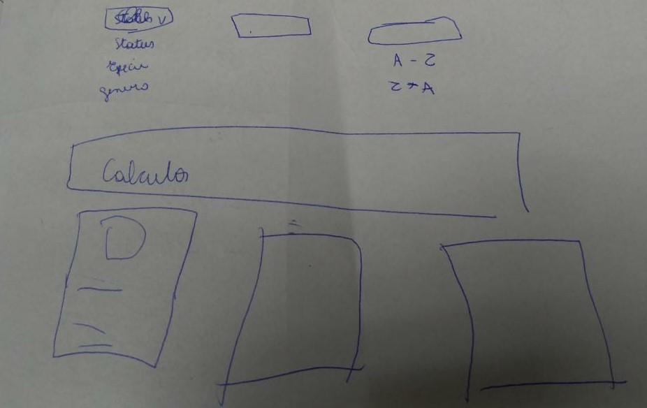
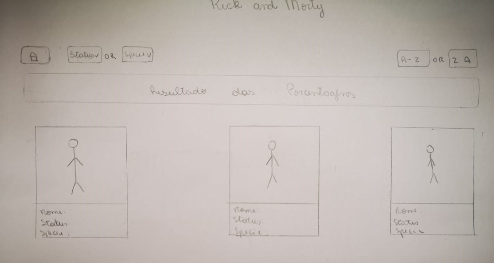
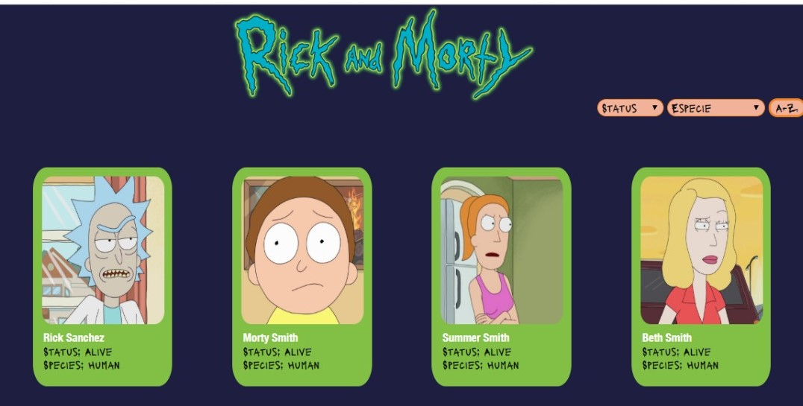

# Data Lovers

## Índice

* [1. O Projeto](#1-O-Projeto)
* [2. Objetivos de Aprendizagem](#2-objetivos-de-aprendizagem)
* [3. Produto](#3-Produto)
* [4. História de Usuário](#4-História-de-Usuário)
* [5. Protótipo de Baixa Fidelidade](#5-Protótipo-de-Baixa-Fidelidade)
* [6. Interface final](#6-Interface-final)

***

## 1. O Projeto

O projeto consiste em construir uma página web com um conjuto de dados definido,
onde o usuário consiga filtrar, ordenar e receber informação relevantes como por exemplo médias.
Fizemos esse projeto com a lista de personagens da série Rick and Morty.

## 2. Objetivos de Aprendizagems

O objetivo principal deste projeto é que aprenda a desenhar e construir uma interface web onde se possa visualizar e manipular dados, entendendo o que o usuário necessita.

## 3. Produto

Rick and Morty - Meet the Characters é uma página web onde pode se visualizar cards com algumas informações sobre os personagens
da serie Rick and Morty. O usuário pode escolher entre dois filtros, uma das opções é o de Status, onde o usuário pode escolher entre três opções: alive, dead ou unknown. A Segunda opção é filtrar por species (espécie), existem doze opções, alguma delas são: human, alien, robot...

Além de visualizar os personagens, aqui os fãs da serie Rick and Morty que podem treinar seu inglês enquanto
navegam na página.

Por isso, focamos no público que já assite a série e desejam encontrar informações de forma rápida e certeiras.

## 4. História de Usuário

Pedro tem 17 anos, está cursando o ensino-médio, tem interesse por ciência e busca aprimorar seu inglês. Como usuário gostaria de ordenar de A-Z.

Amanda tem 27 anos, trabalha com análise sócio-cultural, tem interesse por ficção científica e no seu tempo livre procura assistir desenhos de humor ácido, tendo assim um pouco de diversão dentro de uma rotina corrida.
Amanda como usuária gostaria de conseguir filtrar entre as espécies.

## 5. Protótipo de Baixa Fidelidade

### Protótipo Inicial

### Segundo Protótipo

### Terceiro Protótipo

Aqui identificamos a dificuldade do usuário de entender as opções de filtro. O usuário também sentiu falta de um botão onde pudesse retornar para a home. Esses problemas foram resulvidos na interface final.

## 6. Interface final

A interface final ficou da seguinte maneira

***
